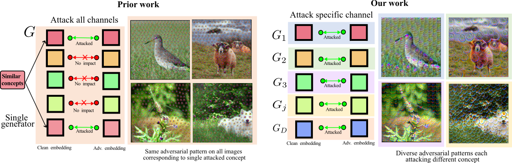

# NAT: Learning to Attack Neurons for Enhanced Adversarial Transferability (WACV 2025)
Krishna Kanth Nakka and Alexandre Alahi





### Introduction
The generation of transferable adversarial perturbations typically involves training a generator to maximize embedding separation between clean and adversarial images at a single mid-layer of a source model. In this work, we build on this approach and introduce Neuron Attack for Transferability (NAT), a method designed to target specific neuron within the embedding. Our approach is motivated by the observation that previous layer-level optimizations often disproportionately focus on a few neurons representing similar concepts, leaving other neurons within the attacked layer minimally affected. NAT shifts the focus from embeddinglevelseparation to a more fundamental, neuron-specific approach. We find that targeting individual neurons effectively disrupts the core units of the neural network, providing a common basis for transferability across different models. Through extensive experiments on 41 diverse ImageNet models and 9 fine-grained models, NAT achieves fooling rates that surpass existing baselines by over 14% in crossmodel
and 4% in cross-domain settings.


For more details, refer to the main paper and supplementary at [CVF Website](https://openaccess.thecvf.com/content/WACV2025/html/Nakka_NAT_Learning_to_Attack_Neurons_for_Enhanced_Adversarial_Transferability_WACV_2025_paper.html) 

## Setup

The code has been tested on following packages:
```bash
conda env create -f environment.yaml
```

## Dataset

- For evaluation, we use subset of 5000 images available at the [data](data/imagenet_val5k.txt) subfolder. This subset is taken from the [LTP](https://github.com/krishnakanthnakka/Transferable_Perturbations) paper of NeurIPS 2021.


### Trained Model

 - You can easily load and test our generator model attacking `Neuron 250` in layer 18 of `VGG16` via Torch Hub with just a few lines of code:

```python
import torch
generator = torch.hub.load("krishnakanthnakka/NAT", "generator", neuron = 250, layer = 18, source_model = "vgg16")
generator.eval()
generator.cuda()
```


### Evaluation


- WWe have provided the checkpoint for Neuron 250 along with this repository in the releases section. This checkpoint should reproduce the results presented in Tables 2, 3, and 4 of the main paper using the query k=1.

- To run the attack on ResNet152, use the following command:

    ```python
    python eval.py --nat_attacked_neuron 250
    ```

- Please refer to the Table 1 in the [supplementary](https://openaccess.thecvf.com/content/WACV2025/supplemental/Nakka_NAT_Learning_to_WACV_2025_supplemental.pdf) for the exact versions of the target models. 


### Training

- For training, we use the [LTP](https://github.com/krishnakanthnakka/Transferable_Perturbations) repository available and change the loss function to choose the single channel instead of all channels. The modified loss function is available in the file [loss.py](loss.py)

-  For `generator`, we used a slightly modified architecture removing `reflectionpad` as we found that to be make results non-deterministic even with same seed.


### Citation

```
@InProceedings{Nakka_2025_WACV,
    author    = {Nakka, Krishna Kanth and Alahi, Alexandre},
    title     = {NAT: Learning to Attack Neurons for Enhanced Adversarial Transferability},
    booktitle = {Proceedings of the Winter Conference on Applications of Computer Vision (WACV)},
    month     = {February},
    year      = {2025},
    pages     = {7582-7593}
}
```

### Acknowledgements

- I would like thank the authors of [CDA](https://arxiv.org/abs/1905.11736) who inspired me to work in this direction during my PhD around 2021.  
